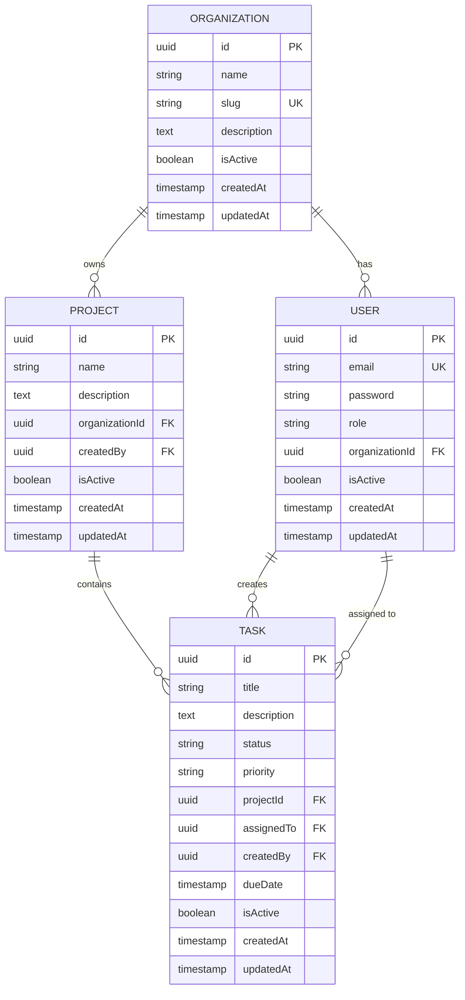

<div align="center">

# 🏢 Multi-Tenant Organization Workspace API

### Enterprise-Grade Multi-Tenant Platform for Modern Teams

[](https://www.typescriptlang.org/)
[](https://nodejs.org/)
[](https://expressjs.com/)
[](https://www.postgresql.org/)
[](https://www.docker.com/)


A robust, production-ready RESTful API for managing multi-tenant organizations, projects, and tasks. Built with TypeScript, Express.js, and TypeORM, this application provides enterprise-grade features including role-based access control, comprehensive monitoring, and containerized deployment.

[Features](#-features) • [Quick Start](#-getting-started) • [API Docs](./docs/api_docs.md) • [Deployment](#-docker-deployment) • [Contributing](#-contributing)

</div>

---

## 📋 Table of Contents

| Section | Description |
|---------|-------------|
| [✨ Features](#-features) | Core functionality and technical capabilities |
| [🛠 Tech Stack](#-tech-stack) | Technologies and frameworks used |
| [🏗 Architecture](#-architecture) | System design and data models |
| [📁 Project Structure](#-project-structure) | Codebase organization |
| [🚀 Getting Started](#-getting-started) | Installation and setup guide |
| [📚 API Documentation](./docs/api_docs.md) | Complete API reference |
| [🔐 Environment Variables](#-environment-variables) | Configuration settings |
| [🐳 Docker Deployment](#-docker-deployment) | Container orchestration |
| [☁️ AWS Deployment](#-aws-deployment) | Cloud infrastructure setup |
| [📊 Monitoring](#-monitoring) | Observability and metrics |
| [🧪 Testing](#-testing) | Test suite and coverage |
| [🔒 Security](#-security) | Security measures and best practices |

## ✨ Features

### 🎯 Core Functionality

| Feature | Description | Status |
|---------|-------------|--------|
| 🏢 **Multi-Tenant Architecture** | Isolated data per organization with secure access control | ✅ Ready |
| 🏛️ **Organization Management** | Create and manage multiple organizations | ✅ Ready |
| 📊 **Project Management** | Create, update, and organize projects within organizations | ✅ Ready |
| ✅ **Task Management** | Comprehensive task tracking with assignments, priorities, and due dates | ✅ Ready |
| 👥 **User Management** | User registration, profile management, and role assignment | ✅ Ready |
| 🔐 **Authentication & Authorization** | JWT-based authentication with role-based access control | ✅ Ready |

### ⚙️ Technical Features

| Category | Features |
|----------|----------|
| 🔷 **Type Safety** | Full TypeScript implementation with strict type checking |
| 🗄️ **Database** | TypeORM migrations for schema version control |
| 🏥 **Health Checks** | Kubernetes-ready readiness, liveness, and health endpoints |
| 📈 **Monitoring** | Prometheus metrics integration with custom business metrics |
| 🛡️ **Rate Limiting** | Protection against abuse with configurable rate limits |
| 🔒 **Security** | Helmet.js, CORS, and secure headers implementation |
| 📝 **Logging** | Winston logger with rotation and multiple transports |
| ⚠️ **Error Handling** | Centralized error handling with detailed logging |
| 🐳 **Docker** | Multi-stage Docker builds for development and production |
| ☁️ **Infrastructure** | Terraform configurations for AWS ECS deployment |

## 🛠 Tech Stack

<table>
<tr>
<td width="50%" valign="top">

### 💻 Backend Core
| Technology | Version | Purpose |
|------------|---------|---------|
| **Node.js** | v22+ | Runtime environment |
| **TypeScript** | v5.9+ | Type-safe development |
| **Express.js** | v5.2+ | Web framework |
| **TypeORM** | v0.3+ | ORM & migrations |
| **PostgreSQL** | v16+ | Primary database |
| **Redis** | v7+ | Caching layer |

### 🔐 Security & Auth
| Technology | Purpose |
|------------|---------|
| **jsonwebtoken** | JWT authentication |
| **bcrypt** | Password hashing |
| **Helmet.js** | Security headers |
| **express-rate-limit** | Rate limiting |

</td>
<td width="50%" valign="top">

### 🚀 DevOps & Infrastructure
| Technology | Purpose |
|------------|---------|
| **Docker** | Containerization |
| **Docker Compose** | Multi-container orchestration |
| **AWS ECS** | Container orchestration |
| **Terraform** | Infrastructure as Code |
| **Nginx** | Reverse proxy |

### 📊 Monitoring & Logging
| Technology | Purpose |
|------------|---------|
| **Prometheus** | Metrics collection |
| **Grafana** | Metrics visualization |
| **Winston** | Structured logging |

### 🧪 Testing
| Technology | Purpose |
|------------|---------|
| **Jest** | Test framework |
| **Supertest** | API testing |
| **ts-jest** | TypeScript support |

</td>
</tr>
</table>

## 🏗 Architecture

### 📊 Entity Relationships



### 👥 Role-Based Access Control

| Role | Permissions | Access Level |
|------|-------------|--------------|
| 🔴 **ORG_ADMIN** | • Create/manage projects<br>• Create/assign tasks<br>• Manage organization users<br>• Full organization access | **Full Access** |
| 🟢 **MEMBER** | • View assigned tasks<br>• Update task status<br>• View organization resources<br>• Read-only project access | **Limited Access** |

### 🏢 Multi-Tenancy Model

| Aspect | Implementation |
|--------|----------------|
| **Isolation Strategy** | Row-level multi-tenancy with `organizationId` |
| **Data Security** | Organization-scoped queries at application layer |
| **Access Control** | JWT tokens contain `organizationId` claim |
| **Query Filtering** | Automatic filtering by tenant context |
| **Data Leakage Prevention** | Validates organization membership on all operations |

### 📈 System Architecture Diagram

```
┌─────────────────────────────────────────────────────────────┐
│                         Clients                             │
│         (Web Browser / Mobile App / API Client)             │
└────────────────────────┬────────────────────────────────────┘
                         │
                         │ HTTPS
                         ▼
┌─────────────────────────────────────────────────────────────┐
│                      Nginx (Load Balancer)                  │
│              SSL Termination / Rate Limiting                │
└────────────────────────┬────────────────────────────────────┘
                         │
                         ▼
┌─────────────────────────────────────────────────────────────┐
│                   Express.js Application                    │
│  ┌──────────────┐  ┌──────────────┐  ┌──────────────┐       │
│  │     Auth     │  │  Middleware  │  │   Business   │       │
│  │   (JWT)      │  │  (Helmet,    │  │    Logic     │       │
│  │              │  │  Rate Limit) │  │              │       │
│  └──────────────┘  └──────────────┘  └──────────────┘       │
└────────────────────────┬────────────────────────────────────┘
                         │
          ┌──────────────┼─
          │              │              
          ▼              ▼             
┌──────────────┐    ┌──────────────┐
│  PostgreSQL  │    │  Prometheus  │
│  (Primary    │    │  (Metrics)   │
│   Database)  │    │              │
└──────────────┘    └──────────────┘
```

## 📁 Project Structure

### 🗂️ Directory Overview

```
multi-tenant-organization-workspace/
│
├── 📂 src/                         # Source code
│   ├── 📂 config/                  # Configuration modules
│   │   ├── 📄 db.ts               # Database connection & TypeORM setup
│   │   └── 📄 env.ts              # Environment variable validation
│   │
│   ├── 📂 middleware/              # Express middleware
│   │   ├── 📄 auth.middleware.ts         # JWT authentication
│   │   ├── 📄 errorHandler.middleware.ts # Global error handler
│   │   └── 📄 ratelimit.middleware.ts    # Rate limiting
│   │
│   ├── 📂 module/                  # Feature modules (domain-driven)
│   │   ├── 📂 auth/               # Authentication
│   │   │   ├── 📄 auth.controller.ts
│   │   │   ├── 📄 auth.dto.ts
│   │   │   ├── 📄 auth.routes.ts
│   │   │   ├── 📄 auth.service.ts
│   │   │   └── 📂 __tests__/
│   │   │
│   │   ├── 📂 organization/       # Organizations
│   │   │   ├── 📄 Organization.entity.ts
│   │   │   ├── 📄 organization.controller.ts
│   │   │   ├── 📄 organization.dto.ts
│   │   │   ├── 📄 organization.repository.ts
│   │   │   ├── 📄 organization.routes.ts
│   │   │   └── 📄 organization.service.ts
│   │   │
│   │   ├── 📂 project/            # Projects
│   │   ├── 📂 task/               # Tasks
│   │   └── 📂 user/               # Users
│   │
│   ├── 📂 types/                   # TypeScript type definitions
│   │   └── 📄 express.d.ts        # Express request extensions
│   │
│   ├── 📂 utils/                   # Utility functions
│   │   ├── 📄 health.ts           # Health check logic
│   │   ├── 📄 jwt.ts              # JWT utilities
│   │   ├── 📄 logger.ts           # Winston logger setup
│   │   ├── 📄 metrics.ts          # Prometheus metrics
│   │   └── 📄 password.ts         # Password hashing/comparison
│   │
│   ├── 📄 app.ts                   # Express app configuration
│   ├── 📄 route.ts                 # Main route aggregator
│   └── 📄 server.ts                # Server entry point
│
├── 📂 tests/                       # Test suites
│   ├── 📄 setup.ts                # Jest global configuration
│   ├── 📂 integration/            # Integration tests (with DB)
│   │   ├── 📄 auth.test.ts
│   │   ├── 📄 organization.test.ts
│   │   └── 📄 task.test.ts
│   └── 📂 unit/                   # Unit tests (isolated)
│       ├── 📄 password.test.ts
│       └── 📄 jwt.test.ts
│
├── 📂 docker/                      # Docker configurations
│   ├── 📄 Dockerfile              # Production Dockerfile
│   ├── 📄 Dockerfile.dev          # Development Dockerfile
│   ├── 📄 Dockerfile.prod         # Optimized production build
│   ├── 📄 docker-compose.yml      # Production compose
│   ├── 📄 docker-compose.dev.yml  # Development compose
│   └── 📄 nginx.conf              # Nginx reverse proxy config
│
├── 📂 terraform/                   # Infrastructure as Code
│   ├── 📄 main.tf                 # Main Terraform configuration
│   ├── 📄 ecs.tf                  # ECS cluster & services
│   ├── 📄 secrets.tf              # AWS Secrets Manager
│   └── 📄 variables.tf            # Variable definitions
│
├── 📂 monitoring/                  # Monitoring & observability
│   ├── 📄 docker-compose.monitoring.yml
│   └── 📄 prometheus.yml          # Prometheus configuration
│
├── 📂 docs/                        # Documentation (empty/future)
├── 📄 .env.example                 # Environment template
├── 📄 .gitignore                   # Git ignore patterns
├── 📄 jest.config.js              # Jest configuration
├── 📄 package.json                # Dependencies & scripts
├── 📄 README.md                   # This file
└── 📄 tsconfig.json               # TypeScript configuration
```

### 🎯 Module Architecture Pattern

Each feature module follows a consistent structure:

```
module/
│
├── 📄 Entity.entity.ts           # TypeORM entity (database model)
├── 📄 dto.ts                     # Data Transfer Objects (validation)
├── 📄 repository.ts              # Database operations (queries)
├── 📄 service.ts                 # Business logic layer
├── 📄 controller.ts              # Request/response handlers
├── 📄 routes.ts                  # Express route definitions
└── 📂 __tests__/                 # Module-specific tests
    ├── 📄 service.test.ts
    └── 📄 controller.test.ts
```

### 🔄 Request Flow Architecture

```
Client Request
    ↓
┌─────────────────────────────────────────┐
│  Express Middleware Stack               │
│  • CORS                                 │
│  • Helmet (Security Headers)            │
│  • Body Parser                          │
│  • Request Logger                       │
│  • Rate Limiter                         │
└──────────────────┬──────────────────────┘
                   ↓
┌─────────────────────────────────────────┐
│  Authentication Middleware              │
│  • JWT Token Validation                 │
│  • User Context Injection               │
│  • Role Verification                    │
└──────────────────┬──────────────────────┘
                   ↓
┌─────────────────────────────────────────┐
│  Route Handler (Controller)             │
│  • Input Validation (DTO)               │
│  • Call Service Layer                   │
│  • Format Response                      │
└──────────────────┬──────────────────────┘
                   ↓
┌─────────────────────────────────────────┐
│  Service Layer (Business Logic)         │
│  • Authorization Checks                 │
│  • Business Rules                       │
│  • Call Repository                      │
└──────────────────┬──────────────────────┘
                   ↓
┌─────────────────────────────────────────┐
│  Repository Layer (Data Access)         │
│  • Database Queries (TypeORM)           │
│  • Data Mapping                         │
│  • Transaction Management               │
└──────────────────┬──────────────────────┘
                   ↓
┌─────────────────────────────────────────┐
│  PostgreSQL Database                    │
└─────────────────────────────────────────┘
```

### 📊 Code Organization Principles

| Layer | Responsibility | Example |
|-------|---------------|---------|
| **Entity** | Database schema, relationships | `User.entity.ts` |
| **DTO** | Request/response validation | `CreateUserDto` |
| **Repository** | Database queries | `userRepo.findByEmail()` |
| **Service** | Business logic, orchestration | `createUser()`, `validateAccess()` |
| **Controller** | HTTP request handling | `async create(req, res)` |
| **Routes** | URL mapping | `router.post('/users', controller.create)` |
| **Middleware** | Cross-cutting concerns | `authenticate`, `rateLimit` |

### 📏 File Naming Conventions

| Type | Pattern | Example |
|------|---------|---------|
| **Entity** | `PascalCase.entity.ts` | `User.entity.ts` |
| **DTO** | `camelCase.dto.ts` | `createUser.dto.ts` |
| **Service** | `camelCase.service.ts` | `auth.service.ts` |
| **Controller** | `camelCase.controller.ts` | `user.controller.ts` |
| **Repository** | `camelCase.repository.ts` | `user.repository.ts` |
| **Routes** | `camelCase.routes.ts` | `user.routes.ts` |
| **Tests** | `camelCase.test.ts` | `auth.test.ts` |
| **Utilities** | `camelCase.ts` | `logger.ts` |


## 🚀 Getting Started

### 📋 Prerequisites

| Requirement | Version |
|-------------|---------|
| Node.js | 22+ |
| npm/yarn | Latest |
| PostgreSQL | 16+ |
| Docker & Docker Compose | Latest |

### 📦 Installation

<details>
<summary><b>🔧 Method 1: Local Development Setup</b></summary>

#### Step 1: Clone the repository
```bash
git clone https://github.com/md-zihad/Multi-Tenant-Organization-Workspace.git
cd Multi-Tenant-Organization-Workspace
```

#### Step 2: Install dependencies
```bash
npm install
```

#### Step 3: Set up environment variables
```bash
cp .env.example .env
# Edit .env with your configuration
```

#### Step 4: Start PostgreSQL (if not using Docker)

**macOS (Homebrew)**
```bash
brew services start postgresql
createdb multi_tenant_org
```

**Ubuntu/Debian**
```bash
sudo systemctl start postgresql
createdb multi_tenant_org
```

**Windows**
```powershell
# Start PostgreSQL service from Services panel
# Or use pgAdmin to create database
```

#### Step 5: Run database migrations
```bash
npm run migration:run
```

#### Step 6: Start the development server
```bash
npm run dev
```

✅ **API is now available at:** `http://localhost:4000`

</details>

<details>
<summary><b>🐳 Method 2: Quick Start with Docker (Recommended)</b></summary>

```bash
# Start all services (app, database, redis, nginx)
cd docker
docker-compose up -d

# View logs
docker-compose logs -f app

# Check service status
docker-compose ps

# Stop services
docker-compose down
```

✅ **All services running!** 
- 🌐 API: `http://localhost:4000`
- 🗄️ PostgreSQL: `localhost:5432`
- 🔴 Redis: `localhost:6379`
- 🔷 Nginx: `http://localhost:80`

</details>

### ✅ Verify Installation

Test the API is running:

```bash
# Health check
curl http://localhost:4000/health

# Expected response
{
  "status": "healthy",
  "timestamp": "2026-03-09T10:30:00.000Z",
  "services": {
    "database": { "status": "healthy" },
    "memory": { "status": "healthy" }
  }
}
```

## 🔐 Environment Variables

### 📝 Configuration File

Create a `.env` file in the root directory with the following variables:

<table>
<tr>
<td width="50%" valign="top">

### 🖥️ Server Configuration
| Variable | Example |
|----------|---------|
| `NODE_ENV` | `development` |
| `PORT` | `4000` |
| `HOST` | `0.0.0.0` |

### 🗄️ Database Configuration
| Variable | Example |
|----------|---------|
| `DB_HOST` | `localhost` |
| `DB_PORT` | `5432` |
| `DB_USERNAME` | `postgres` |
| `DB_PASSWORD` | `secure_pass` |
| `DB_NAME` | `multi_tenant_org` |
| `DB_SSL` | `false` |


### 🔑 JWT Configuration
| Variable | Example |
|----------|---------|
| `JWT_SECRET` | `your_secret_32_chars_min` |
| `JWT_EXPIRES_IN` | `24h` |


</td>
</tr>
</table>

### 📄 Complete `.env` Example

```bash
# Server Configuration
NODE_ENV=development
PORT=4000
HOST=0.0.0.0

# Database Configuration
DB_HOST=localhost
DB_PORT=5432
DB_USERNAME=postgres
DB_PASSWORD=your_secure_password
DB_NAME=multi_tenant_org
DB_SSL=false


# JWT Configuration
JWT_SECRET=your_very_secure_jwt_secret_key_min_15_chars
JWT_EXPIRES_IN=24h

```

### ⚠️ Security Best Practices

| ⚠️ Warning | Description |
|-----------|-------------|
| 🚫 **Never commit `.env`** | Add to `.gitignore` immediately |
| 🔒 **Strong JWT_SECRET** | Minimum 32 characters, use random generator |
| ⚡ **DB_SYNCHRONIZE=false** | In production - prevents automatic schema changes |
| 🔐 **Use SSL in production** | Set `DB_SSL=true` for production databases |
| 📋 **Environment-specific files** | Use `.env.development`, `.env.production`, etc. |

## 🐳 Docker Deployment

### 🏗️ Available Environments

| Environment | File | Purpose | Use Case |
|-------------|------|---------|----------|
| **Development** | `docker-compose.dev.yml` | Hot reload, debugging | Local development |
| **Production** | `docker-compose.yml` | Optimized, multi-stage build | Production deployment |
| **Monitoring** | `docker-compose.monitoring.yml` | Prometheus + Grafana | Observability stack |

### 🚀 Quick Start Commands

<table>
<tr>
<td width="50%" valign="top">

### 🔧 Development Mode
```bash
cd docker

# Start all services
docker-compose -f docker-compose.dev.yml up -d

# View logs (all services)
docker-compose -f docker-compose.dev.yml logs -f

# View app logs only
docker-compose -f docker-compose.dev.yml logs -f app

# Restart app service
docker-compose -f docker-compose.dev.yml restart app

# Stop all services
docker-compose -f docker-compose.dev.yml down
```

</td>
<td width="50%" valign="top">

### 🏭 Production Mode
```bash
cd docker

# Build and start
docker-compose up -d --build

# Check service health
docker-compose ps

# View logs
docker-compose logs -f app

# Scale app instances
docker-compose up -d --scale app=3

# Stop all services
docker-compose down

# Remove volumes ⚠️
docker-compose down -v
```

</td>
</tr>
</table>

### 📦 Service Architecture

```
┌─────────────────────────────────────────────────────────┐
│                    Docker Network                       │
│                                                         │
│  ┌────────────┐    ┌────────────┐    ┌────────────┐     │
│  │   Nginx    │────│    App     │────│ PostgreSQL │     │
│  │  (Port 80) │    │ (Port 4000)│    │ (Port 5432)│     │
│  └────────────┘    └────────────┘    └────────────┘     │
│                                                         │
│                                                         │
│                                                         │
│                                                         │
└─────────────────────────────────────────────────────────┘
```

### 🔍 Service Details

| Service | Image | Port(s) | Volume | Health Check |
|---------|-------|---------|--------|--------------|
| **App** | `node:22-alpine` | 4000 | - | `/health` endpoint |
| **PostgreSQL** | `postgres:16-alpine` | 5432 | `postgres_data` | `pg_isready` |
| **Redis** | `redis:7-alpine` | 6379 | `redis_data` | `redis-cli ping` |
| **Nginx** | `nginx:alpine` | 80, 443 | `./nginx.conf`, `./ssl` | - |

### 🛠️ Useful Docker Commands

```bash
# Execute commands in running container
docker-compose exec app npm run migration:run
docker-compose exec app npm test
docker-compose exec postgres psql -U postgres -d multi_tenant_org

# View container resource usage
docker stats

# Inspect container logs
docker logs --tail 100 -f <container_id>

# Clean up unused resources
docker system prune -a --volumes

# Rebuild specific service
docker-compose build --no-cache app
```

### 📊 Monitoring Stack

```bash
cd monitoring
docker-compose -f docker-compose.monitoring.yml up -d

# Access services
# Prometheus: http://localhost:9090
# Grafana:    http://localhost:3000 (admin/admin)
```

## ☁️ AWS Deployment

### 📋 Prerequisites Checklist

| Requirement | Command to Verify | Status |
|-------------|-------------------|--------|
| AWS CLI | `aws --version` | ⬜ |
| AWS Credentials | `aws sts get-caller-identity` | ⬜ |
| Terraform | `terraform --version` | ⬜ |
| Docker | `docker --version` | ⬜ |

### 🚀 Deployment Workflow

```
┌─────────────────┐
│  1. Initialize  │  terraform init
└────────┬────────┘
         │
         ▼
┌─────────────────┐
│   2. Validate   │  terraform validate
└────────┬────────┘
         │
         ▼
┌─────────────────┐
│    3. Plan      │  terraform plan
└────────┬────────┘
         │
         ▼
┌─────────────────┐
│    4. Apply     │  terraform apply
└────────┬────────┘
         │
         ▼
┌─────────────────┐
│   5. Deploy!    │  Infrastructure Ready
└─────────────────┘
```

### 📝 Step-by-Step Deployment

<details>
<summary><b>1️⃣ Configure AWS Credentials</b></summary>

```bash
# Configure AWS CLI
aws configure

# Verify credentials
aws sts get-caller-identity
```

**Expected Output:**
```json
{
  "UserId": "AIDAXXXXXXXXXXXXXXXXX",
  "Account": "123456789012",
  "Arn": "arn:aws:iam::123456789012:user/your-username"
}
```

</details>

<details>
<summary><b>2️⃣ Initialize Terraform</b></summary>

```bash
cd terraform
terraform init
```

**This will:**
- Download AWS provider plugins
- Initialize backend configuration
- Prepare working directory

</details>

<details>
<summary><b>3️⃣ Customize Variables (Optional)</b></summary>

Create `terraform.tfvars`:

```hcl
aws_region        = "us-east-1"
environment       = "production"
app_name          = "multi-tenant-org"
db_instance_class = "db.t3.micro"
ecs_task_cpu      = "256"
ecs_task_memory   = "512"
```

</details>

<details>
<summary><b>4️⃣ Review Infrastructure Plan</b></summary>

```bash
terraform plan
```

**Review the resources to be created:**
- ✅ VPC and networking
- ✅ ECS cluster and services
- ✅ RDS PostgreSQL instance
- ✅ Application Load Balancer
- ✅ Security groups
- ✅ IAM roles and policies

</details>

<details>
<summary><b>5️⃣ Deploy Infrastructure</b></summary>

```bash
terraform apply

# Auto-approve (use with caution)
terraform apply -auto-approve
```

**Deployment time:** ~10-15 minutes

</details>

### 🏗️ Infrastructure Components

<table>
<tr>
<td width="50%" valign="top">

### Network Layer
| Component | Configuration |
|-----------|---------------|
| **VPC** | 10.0.0.0/16 |
| **Public Subnets** | 2 AZs |
| **Private Subnets** | 2 AZs |
| **NAT Gateways** | 2 (HA) |
| **Internet Gateway** | 1 |

### Compute Layer
| Component | Configuration |
|-----------|---------------|
| **ECS Cluster** | Fargate |
| **Task Definition** | 256 CPU, 512 MB |
| **Desired Count** | 2 tasks (HA) |
| **Auto Scaling** | 2-10 tasks |

</td>
<td width="50%" valign="top">

### Data Layer
| Component | Configuration |
|-----------|---------------|
| **RDS PostgreSQL** | db.t3.micro |
| **Multi-AZ** | Enabled |
| **Backup Retention** | 7 days |
| **ElastiCache Redis** | cache.t3.micro |

### Load Balancing
| Component | Configuration |
|-----------|---------------|
| **ALB** | Application LB |
| **Target Groups** | ECS tasks |
| **Health Check** | `/health` |
| **SSL/TLS** | ACM certificate |

### Security
| Component | Configuration |
|-----------|---------------|
| **Secrets Manager** | DB credentials |
| **IAM Roles** | Task execution |
| **Security Groups** | Least privilege |

</td>
</tr>
</table>

### 📊 AWS Architecture Diagram

```
                          ┌─────────────────┐
                          │   CloudFront    │ (Optional)
                          │      (CDN)      │
                          └────────┬────────┘
                                   │
                          ┌────────▼────────┐
                          │  Route 53 (DNS) │
                          └────────┬────────┘
                                   │
        ┌──────────────────────────┼──────────────────────────┐
        │                       AWS VPC                        │
        │                                                       │
        │   ┌────────────────────────────────────────────┐   │
        │   │   Application Load Balancer (Public)       │   │
        │   └──────────┬────────────────┬────────────────┘   │
        │              │                │                      │
        │   ┌──────────▼─────┐   ┌─────▼──────────┐         │
        │   │ ECS Service    │   │  ECS Service   │         │
        │   │ (Fargate Task) │   │ (Fargate Task) │         │
        │   │  Private Subnet│   │  Private Subnet│         │
        │   └────────┬───────┘   └────────┬───────┘         │
        │            │                     │                  │
        │   ┌────────▼─────────────────────▼────────┐       │
        │   │            RDS PostgreSQL              │       │
        │   │         (Multi-AZ, Private)            │       │
        │   └────────────────────────────────────────┘       │
        │                                                      │
        │   ┌──────────────────────────────────────┐         │
        │   │       ElastiCache Redis              │         │
        │   │          (Private)                   │         │
        │   └──────────────────────────────────────┘         │
        │                                                      │
        │   ┌──────────────────────────────────────┐         │
        │   │          CloudWatch Logs             │         │
        │   └──────────────────────────────────────┘         │
        └──────────────────────────────────────────────────────┘
```

### 🔧 Post-Deployment Tasks

```bash
# Get ALB endpoint
terraform output alb_dns_name

# Update environment variables in ECS task definition
aws ecs update-service --cluster multi-tenant-cluster --service app-service --force-new-deployment

# View logs
aws logs tail /ecs/multi-tenant-app --follow
```

### 🗑️ Teardown Infrastructure

```bash
cd terraform

# Preview resources to be destroyed
terraform plan -destroy

# Destroy all resources
terraform destroy

# Auto-confirm (use with caution)
terraform destroy -auto-approve
```

⚠️ **Warning:** This will permanently delete all resources and data!

## 📊 Monitoring

### 🎯 Observability Stack

| Component | Purpose | Access URL | Default Credentials |
|-----------|---------|------------|---------------------|
| **Prometheus** | Metrics collection | `http://localhost:9090` | - |
| **Grafana** | Metrics visualization | `http://localhost:3000` | admin / admin |
| **Winston** | Application logging | Console + Files | - |

### 🚀 Quick Start Monitoring

```bash
cd monitoring
docker-compose -f docker-compose.monitoring.yml up -d

# Check service status
docker-compose -f docker-compose.monitoring.yml ps

# View logs
docker-compose -f docker-compose.monitoring.yml logs -f
```

### 📈 Available Metrics

#### Application Metrics (`/metrics`)

<table>
<tr>
<td width="50%" valign="top">

### HTTP Metrics
| Metric | Type | Description |
|--------|------|-------------|
| `http_request_duration_seconds` | Histogram | Request latency |
| `http_requests_total` | Counter | Total requests |
| `http_request_size_bytes` | Summary | Request size |
| `http_response_size_bytes` | Summary | Response size |

### Database Metrics
| Metric | Type | Description |
|--------|------|-------------|
| `db_connection_pool_size` | Gauge | Active connections |
| `db_query_duration_seconds` | Histogram | Query execution time |
| `db_errors_total` | Counter | Database errors |

</td>
<td width="50%" valign="top">

### Node.js Metrics
| Metric | Type | Description |
|--------|------|-------------|
| `nodejs_heap_size_total_bytes` | Gauge | Total heap size |
| `nodejs_heap_size_used_bytes` | Gauge | Used heap size |
| `nodejs_external_memory_bytes` | Gauge | External memory |
| `nodejs_eventloop_lag_seconds` | Gauge | Event loop lag |

### Business Metrics
| Metric | Type | Description |
|--------|------|-------------|
| `tasks_created_total` | Counter | Tasks created |
| `projects_created_total` | Counter | Projects created |
| `users_active_total` | Gauge | Active users |
| `organizations_total` | Gauge | Total organizations |

</td>
</tr>
</table>

### 🏥 Health Check Endpoints

#### `/health` - Complete Health Check
```json
{
  "status": "healthy",
  "timestamp": "2026-03-09T10:30:00.000Z",
  "services": {
    "database": {
      "status": "healthy",
      "responseTime": 15
    },
    "memory": {
      "status": "healthy",
      "usage": 150000000,
      "total": 2000000000,
      "percentage": 7.5
    },
    "disk": {
      "status": "healthy"
    }
  },
  "uptime": 3600
}
```

#### Health Status Indicators

| Endpoint | Purpose | Kubernetes Use | Response Code |
|----------|---------|----------------|---------------|
| `/health` | Overall system health | Initial check | 200 (healthy) / 503 (unhealthy) |
| `/ready` | Service ready for traffic | Readiness probe | 200 (ready) / 503 (not ready) |
| `/live` | Service is alive | Liveness probe | 200 (alive) / 503 (dead) |

### 📊 Grafana Dashboard Setup

#### 1. Add Prometheus Data Source
```
Configuration → Data Sources → Add data source
Name: Prometheus
URL: http://prometheus:9090
Access: Server (default)
```

#### 2. Import Pre-built Dashboards

| Dashboard | ID | Purpose |
|-----------|-----|---------|
| Node.js Application | 11159 | Application metrics |
| PostgreSQL Database | 9628 | Database performance |
| Express.js | 10106 | Express metrics |
| Docker Container | 193 | Container stats |

#### 3. Custom Dashboard Panels

**Request Rate Panel:**
```promql
rate(http_requests_total[5m])
```

**Error Rate Panel:**
```promql
rate(http_requests_total{status=~"5.."}[5m])
```

**Response Time (P95):**
```promql
histogram_quantile(0.95, rate(http_request_duration_seconds_bucket[5m]))
```

**Database Connection Pool:**
```promql
db_connection_pool_size
```

### 📝 Logging Configuration

#### Log Levels

| Level | Use Case | Example |
|-------|----------|---------|
| `error` | System errors | Database connection failed |
| `warn` | Warning conditions | Deprecated API usage |
| `info` | General information | Server started |
| `debug` | Debugging information | Function parameters |

#### Log Format (JSON)

```json
{
  "level": "info",
  "message": "User login successful",
  "timestamp": "2026-03-09T10:30:00.000Z",
  "service": "multi-tenant-organization-workspace",
  "userId": "uuid",
  "organizationId": "uuid",
  "method": "POST",
  "path": "/api/v1/auth/login",
  "statusCode": 200,
  "duration": 145
}
```

### 🔔 Alerting Rules (Prometheus)

Create `monitoring/alert_rules.yml`:

```yaml
groups:
  - name: api_alerts
    rules:
      - alert: HighErrorRate
        expr: rate(http_requests_total{status=~"5.."}[5m]) > 0.05
        for: 5m
        labels:
          severity: critical
        annotations:
          summary: "High error rate detected"
          
      - alert: HighResponseTime
        expr: histogram_quantile(0.95, rate(http_request_duration_seconds_bucket[5m])) > 1
        for: 10m
        labels:
          severity: warning
        annotations:
          summary: "Response time above 1 second"
          
      - alert: DatabaseDown
        expr: up{job="postgres"} == 0
        for: 1m
        labels:
          severity: critical
        annotations:
          summary: "Database is down"
```

## 🧪 Testing

### 🎯 Test Coverage Overview

| Metric | Target | Current Status |
|--------|--------|----------------|
| **Statements** | > 80% | 🎯 Target |
| **Branches** | > 75% | 🎯 Target |
| **Functions** | > 80% | 🎯 Target |
| **Lines** | > 80% | 🎯 Target |

### 🚀 Running Tests

<table>
<tr>
<td width="50%" valign="top">

### Quick Commands
```bash
# Run all tests
npm test

# Unit tests only
npm run test:unit

# Integration tests only
npm run test:integration

# Watch mode (auto-rerun)
npm run test:watch

# Coverage report
npm run test:coverage
```

</td>
<td width="50%" valign="top">

### Advanced Options
```bash
# Run specific test file
npm test -- auth.test.ts

# Run tests matching pattern
npm test -- --testNamePattern="login"

# Update snapshots
npm test -- -u

# Debug mode
node --inspect-brk node_modules/.bin/jest --runInBand

# Silent mode (minimal output)
npm test -- --silent
```

</td>
</tr>
</table>

### 📂 Test Structure

```
tests/
├── setup.ts                    # Global test configuration
├── unit/                       # Unit tests (fast, isolated)
│   ├── password.test.ts       # Password utility tests
│   ├── jwt.test.ts            # JWT utility tests
│   └── validation.test.ts     # Validation logic tests
└── integration/                # Integration tests (with DB)
    ├── auth.test.ts           # Authentication flow tests
    ├── organization.test.ts   # Organization CRUD tests
    ├── project.test.ts        # Project management tests
    └── task.test.ts           # Task management tests
```

### ✅ Test Categories

| Category | Description | Speed | Database |
|----------|-------------|-------|----------|
| **Unit Tests** | Test individual functions/modules | ⚡ Fast | ❌ No |
| **Integration Tests** | Test API endpoints with DB | 🐢 Slower | ✅ Yes |
| **E2E Tests** | Test complete user flows | 🐌 Slowest | ✅ Yes |

### 📝 Writing Tests

#### Unit Test Example

```typescript
import { describe, it, expect } from '@jest/globals';
import { hashPassword, comparePassword } from '../src/utils/password';

describe('Password Utilities', () => {
  it('should hash password correctly', async () => {
    const password = 'Test123!';
    const hashed = await hashPassword(password);
    
    expect(hashed).not.toBe(password);
    expect(hashed.length).toBeGreaterThan(0);
  });

  it('should compare passwords correctly', async () => {
    const password = 'Test123!';
    const hashed = await hashPassword(password);
    
    const isValid = await comparePassword(password, hashed);
    expect(isValid).toBe(true);
  });
});
```

#### Integration Test Example

```typescript
import { describe, it, expect, beforeAll, afterAll } from '@jest/globals';
import request from 'supertest';
import app from '../src/app';
import { AppDataSource } from '../src/config/db';

describe('Authentication API', () => {
  beforeAll(async () => {
    await AppDataSource.initialize();
  });

  afterAll(async () => {
    await AppDataSource.destroy();
  });

  describe('POST /api/v1/auth/login', () => {
    it('should login with valid credentials', async () => {
      const response = await request(app)
        .post('/api/v1/auth/login')
        .send({
          email: 'test@example.com',
          password: 'password123'
        });

      expect(response.status).toBe(200);
      expect(response.body).toHaveProperty('accessToken');
      expect(response.body.user.email).toBe('test@example.com');
    });

    it('should reject invalid credentials', async () => {
      const response = await request(app)
        .post('/api/v1/auth/login')
        .send({
          email: 'test@example.com',
          password: 'wrongpassword'
        });

      expect(response.status).toBe(401);
    });
  });
});
```

### 📊 Coverage Report

After running `npm run test:coverage`, view the report:

```bash
# Open HTML coverage report
open coverage/lcov-report/index.html  # macOS
xdg-open coverage/lcov-report/index.html  # Linux
start coverage/lcov-report/index.html  # Windows
```

### 🎭 Test Scenarios by Module

<table>
<tr>
<td width="50%" valign="top">

### Authentication Tests
- ✅ Successful login
- ✅ Invalid credentials
- ✅ Inactive user rejection
- ✅ JWT token generation
- ✅ Token expiration
- ✅ Rate limiting

### Organization Tests
- ✅ Create organization
- ✅ Duplicate slug prevention
- ✅ List organizations
- ✅ Authorization checks

</td>
<td width="50%" valign="top">

### Project Tests
- ✅ Create project (ORG_ADMIN)
- ✅ List organization projects
- ✅ Update project
- ✅ Cross-tenant access prevention
- ✅ Soft delete

### Task Tests
- ✅ Create task with assignment
- ✅ Get assigned tasks (MEMBER)
- ✅ Update task status
- ✅ Reassign tasks
- ✅ Priority/status validation

</td>
</tr>
</table>

### 🔧 CI/CD Integration

#### GitHub Actions Example

```yaml
name: Tests

on: [push, pull_request]

jobs:
  test:
    runs-on: ubuntu-latest
    
    services:
      postgres:
        image: postgres:16-alpine
        env:
          POSTGRES_PASSWORD: test
        options: >-
          --health-cmd pg_isready
          --health-interval 10s
          --health-timeout 5s
          --health-retries 5
    
    steps:
      - uses: actions/checkout@v3
      - uses: actions/setup-node@v3
        with:
          node-version: '22'
      
      - run: npm ci
      - run: npm run test:unit
      - run: npm run test:integration
      - run: npm run test:coverage
      
      - name: Upload coverage
        uses: codecov/codecov-action@v3
        with:
          files: ./coverage/lcov.info
```

## 🔒 Security

### 🛡️ Implemented Security Measures

<table>
<tr>
<td width="50%" valign="top">

### Authentication & Authorization
| Feature | Implementation | Status |
|---------|----------------|--------|
| **Authentication** | JWT-based tokens | ✅ |
| **Password Hashing** | bcrypt (10 rounds) | ✅ |
| **Token Expiration** | Configurable (24h default) | ✅ |
| **Role-Based Access** | ORG_ADMIN, MEMBER | ✅ |
| **Session Management** | Stateless JWT | ✅ |

### API Security
| Feature | Implementation | Status |
|---------|----------------|--------|
| **Rate Limiting** | 100 req/15min (general) | ✅ |
| **Login Rate Limiting** | 5 attempts/15min | ✅ |
| **CORS** | Configurable origins | ✅ |
| **Security Headers** | Helmet.js | ✅ |
| **Input Validation** | DTO validation | ✅ |

</td>
<td width="50%" valign="top">

### Data Security
| Feature | Implementation | Status |
|---------|----------------|--------|
| **SQL Injection** | TypeORM parameterized | ✅ |
| **XSS Protection** | Helmet.js | ✅ |
| **Data Isolation** | Organization-scoped | ✅ |
| **Sensitive Data** | Not logged | ✅ |
| **HTTPS** | Enforced (production) | ✅ |

### Infrastructure Security
| Feature | Implementation | Status |
|---------|----------------|--------|
| **Environment Variables** | .env files | ✅ |
| **Secrets Management** | AWS Secrets Manager | ✅ |
| **Database SSL** | Configurable | ✅ |
| **Container Security** | Non-root user | ✅ |
| **Network Isolation** | VPC, Security Groups | ✅ |

</td>
</tr>
</table>

### 🔐 Security Headers Configuration

```typescript
// Implemented via Helmet.js
{
  "Content-Security-Policy": "default-src 'self'",
  "X-Content-Type-Options": "nosniff",
  "X-Frame-Options": "DENY",
  "X-XSS-Protection": "1; mode=block",
  "Strict-Transport-Security": "max-age=31536000",
  "Referrer-Policy": "no-referrer"
}
```

### 🚦 Rate Limiting Configuration

| Endpoint Pattern | Limit | Window | Purpose |
|-----------------|-------|--------|---------|
| `/api/v1/*` (General) | 100 requests | 15 minutes | Prevent API abuse |
| `/api/v1/auth/login` | 5 attempts | 15 minutes | Prevent brute force |
| `/api/v1/auth/*` | 10 requests | 15 minutes | Auth endpoint protection |

### 🔑 Password Security

#### Requirements
- ✅ Minimum 8 characters
- ✅ bcrypt hashing (10 salt rounds)
- ✅ No plaintext storage
- ✅ Secure comparison (timing-safe)

#### Password Hashing Flow

```
User Password → bcrypt.hash(password, 10) → Stored Hash
     ↓                                            ↓
Login Password → bcrypt.compare() ← Retrieved Hash
     ↓                    ↓
  [Match] → JWT Token Generated
  [No Match] → 401 Unauthorized
```

### 🎫 JWT Token Structure

```json
{
  "header": {
    "alg": "HS256",
    "typ": "JWT"
  },
  "payload": {
    "id": "user-uuid",
    "email": "user@example.com",
    "role": "ORG_ADMIN",
    "organizationId": "org-uuid",
    "iat": 1709980200,
    "exp": 1710066600
  },
  "signature": "..."
}
```

### 🔍 Security Best Practices

<table>
<tr>
<td width="50%" valign="top">

### Development
| Practice | Implementation |
|----------|----------------|
| 🔐 **Strong JWT Secret** | Min 32 characters, random |
| 📝 **No Secrets in Code** | Use .env files |
| 🚫 **No Secrets in Git** | .gitignore .env files |
| 🔄 **Regular Updates** | npm audit weekly |
| 🧪 **Security Testing** | Automated tests |

</td>
<td width="50%" valign="top">

### Production
| Practice | Implementation |
|----------|----------------|
| 🔒 **HTTPS Only** | SSL/TLS certificates |
| 🗄️ **Database SSL** | Encrypted connections |
| 🔑 **Secrets Manager** | AWS/Azure services |
| 📊 **Audit Logging** | Track all changes |
| 🔄 **Auto Updates** | Dependabot enabled |

</td>
</tr>
</table>

### ✅ Security Checklist

<details>
<summary><b>🔧 Pre-Deployment Security Checklist</b></summary>

#### Environment Configuration
- [ ] `JWT_SECRET` is strong (32+ chars) and unique
- [ ] `NODE_ENV` is set to `production`
- [ ] `DB_SYNCHRONIZE` is set to `false`
- [ ] All environment variables validated
- [ ] No default/demo credentials in use

#### Database Security
- [ ] SSL/TLS enabled (`DB_SSL=true`)
- [ ] Strong database password
- [ ] Database not publicly accessible
- [ ] Regular backups configured
- [ ] Connection pooling configured

#### Network Security
- [ ] HTTPS enforced for all endpoints
- [ ] CORS configured properly
- [ ] Rate limiting active
- [ ] Security headers enabled
- [ ] Firewall rules configured

#### Application Security
- [ ] Dependencies updated (`npm audit`)
- [ ] No debug/console logs exposed
- [ ] Error messages sanitized
- [ ] File upload restrictions (if applicable)
- [ ] API versioning in place

#### Monitoring & Logging
- [ ] Security events logged
- [ ] Failed login attempts monitored
- [ ] Alerting configured
- [ ] Log retention policy set
- [ ] Access logs enabled

</details>

### 🚨 Vulnerability Scanning

```bash
# NPM Audit
npm audit
npm audit fix

# Check for outdated packages
npm outdated

# Automated security scanning
npx snyk test

# License compliance
npx license-checker --summary
```

### 🔗 Security Resources

- [OWASP Top 10](https://owasp.org/www-project-top-ten/)
- [Node.js Security Best Practices](https://nodejs.org/en/docs/guides/security/)
- [TypeORM Security](https://typeorm.io/security)
- [Express.js Security Best Practices](https://expressjs.com/en/advanced/best-practice-security.html)


## 🤝 Contributing

We welcome contributions! Here's how you can help make this project better.

### 🚀 Development Workflow

```
1. Fork Repository → 2. Create Branch → 3. Make Changes → 4. Test → 5. Submit PR
```

<details>
<summary><b>📋 Step-by-Step Contribution Guide</b></summary>

#### 1️⃣ Fork the Repository
```bash
# Click "Fork" button on GitHub
# Clone your fork
git clone https://github.com/YOUR_USERNAME/Multi-Tenant-Organization-Workspace.git
cd Multi-Tenant-Organization-Workspace
```

#### 2️⃣ Create a Feature Branch
```bash
# Update main branch
git checkout dev
git pull upstream dev

# Create feature branch
git checkout -b feature/amazing-feature

# Or for bug fixes
git checkout -b fix/bug-description
```

#### 3️⃣ Set Up Development Environment
```bash
# Install dependencies
npm install

# Copy environment file
cp .env.example .env

# Start development server
npm run dev
```

#### 4️⃣ Make Your Changes
- Follow existing code conventions
- Add tests for new features
- Update documentation as needed
- Keep commits focused and atomic

#### 5️⃣ Run Tests and Linting
```bash
# Type checking
npm run type-check

# Linting
npm run lint

# Fix linting issues
npm run lint:fix

# Run tests
npm test

# Check coverage
npm run test:coverage
```

#### 6️⃣ Commit Your Changes
```bash
# Stage changes
git add .

# Commit with conventional commit message
git commit -m "feat: add task filtering by status"
```

#### 7️⃣ Push to Your Fork
```bash
git push origin feature/amazing-feature
```

#### 8️⃣ Open a Pull Request
- Go to original repository on GitHub
- Click "New Pull Request"
- Select your branch
- Fill in PR template
- Wait for review

</details>

### 📝 Code Style Guide

<table>
<tr>
<td width="50%" valign="top">

### TypeScript Best Practices
```typescript
// ✅ Good - Type-safe and explicit
async function createUser(
  data: CreateUserDto
): Promise<UserResponseDto> {
  // Implementation
}

// ❌ Bad - Using 'any'
async function createUser(data: any): Promise<any> {
  // Implementation
}
```

### Naming Conventions
| Type | Convention | Example |
|------|------------|---------|
| Variables | camelCase | `userName` |
| Functions | camelCase | `getUserById()` |
| Classes | PascalCase | `UserService` |
| Interfaces | PascalCase | `UserRepository` |
| Types | PascalCase | `UserDto` |
| Constants | UPPER_CASE | `MAX_LOGIN_ATTEMPTS` |

</td>
<td width="50%" valign="top">

### Code Organization
```typescript
// ✅ Good - Single responsibility
class UserService {
  async createUser(data: CreateUserDto) {
    // Only user creation logic
  }
}

// ✅ Good - Descriptive names
const isUserActive = user.isActive;

// ❌ Bad - Unclear abbreviations
const usrAct = usr.act;
```

### Documentation
```typescript
/**
 * Creates a new user in the system
 * 
 * @param data - User creation data
 * @returns Created user with generated ID
 * @throws Error if email already exists
 */
async function createUser(
  data: CreateUserDto
): Promise<User> {
  // Implementation
}
```

</td>
</tr>
</table>

### 💬 Commit Message Convention

Follow [Conventional Commits](https://www.conventionalcommits.org/):

| Type | Description | Example |
|------|-------------|---------|
| `feat:` | New feature | `feat: add task filtering by status` |
| `fix:` | Bug fix | `fix: resolve organization query bug` |
| `docs:` | Documentation | `docs: update API documentation` |
| `style:` | Code style (formatting) | `style: format code with prettier` |
| `refactor:` | Code refactoring | `refactor: simplify user validation` |
| `test:` | Add/update tests | `test: add integration tests for auth` |
| `chore:` | Maintenance | `chore: update dependencies` |
| `perf:` | Performance improvement | `perf: optimize database queries` |


---

## 👨‍💻 Author

<div align="center">

### **Md. Zihad**

[](https://github.com/md-zihad)
[](https://linkedin.com/in/md-zihad)

</div>

---

## 📊 Project Stats

<div align="center">


</div>

---

